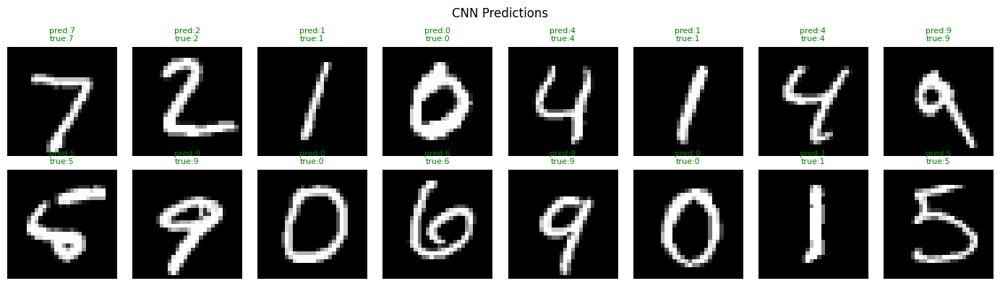
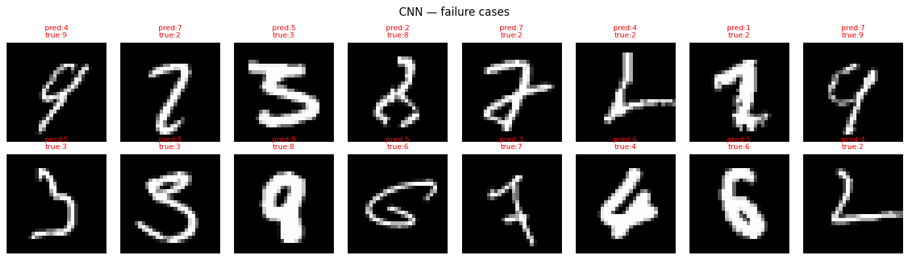

# MNIST Digit Classification: FC vs CNN

Comparing fully-connected and convolutional neural networks on handwritten 
digit recognition, with error analysis.

## What this project does

Trains two architectures on the MNIST dataset (60,000 training images) and 
compares their performance — not just accuracy, but *where* each model fails 
and why.

## Models compared

| Model | Architecture | Test Accuracy |
|-------|-------------|---------------|
| FC-Net | Flatten → Linear(784,128) → Linear(128,64) → Linear(64,10) | 97.2% |
| CNN | Conv2d(32) → MaxPool → Conv2d(64) → MaxPool → Linear(128,10) | 98.97% |

## Key finding

The fully-connected model treats each pixel independently — it has no notion 
of spatial structure. The CNN slides a 3×3 filter across the image, learning 
local features (edges, curves) before combining them into a digit. This 
structural advantage accounts for the ~1.8% accuracy gap.

Error analysis shows both models fail on the same kinds of images: heavily 
stylised handwriting where even humans would hesitate (e.g. a 4 written like 
a 9, a 5 written like an 8).

## How to run

Open `mnist_classification.ipynb` in [Google Colab](https://colab.research.google.com) 
and run all cells. No local installation needed.

## Results

